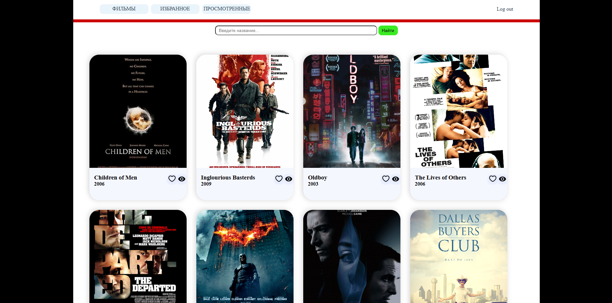
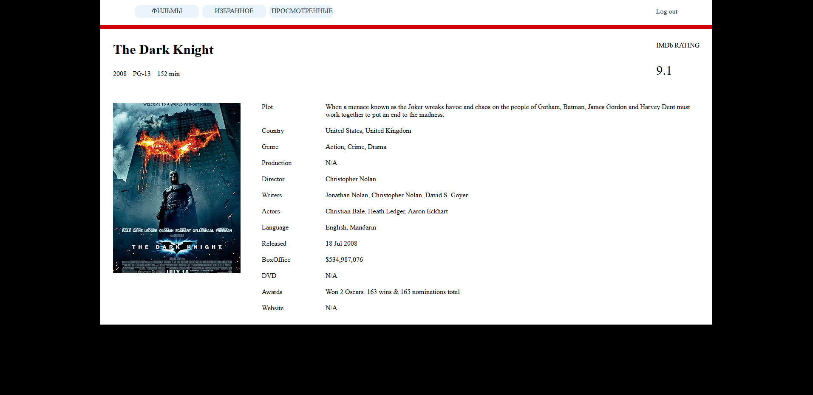

# GoMovie - мини IMDB на Go
Это учебный проект, демонстрирующий навыки работы с Go, PostgreSQL, Docker и внешними API.



Проект позволяет:
+ Регистрацию пользователей с JWT авторизацией
+ Добавление фильмов в избранное и просмотренное
+ Поиск фильмов по точному названию через OMDB API
+ Просмотр подробной информации о фильме, кликнув на карточку



⚠️ Проект создан для демонстрации навыков, не предназначен для продакшн использования.

### Технологии:
+ Backend: Go
+ Базы данных: PostgreSQL
+ API фильмов: [OMDB API](https://www.omdbapi.com/)
+ Контейнеризация: Docker
+ Аутентификация: JWT

При запуске через Docker создаётся **PostgreSQL база данных**, которая уже содержит более 80 фильмов. 

Данные берутся из заранее подготовленного CSV-файла и загружаются автоматически (`movies.csv`)

## OMDB API
Для работы нужен OMDB API Key, который позволяет получать информацию о фильмах.

Вы можете получить ключ бесплатно на 1000 запросов в день: [OMDB API](https://www.omdbapi.com/)

После получения добавьте его в `.env` файл:
```env
OMDB_API_KEY=ваш_ключ_omdb
```

## Запуск
1. Склонируйте репозиторий:
```bash
git clone https://github.com/Kasha225/GoMovie.git
cd GoMovie
```
2. Создайте `.env` файл:
```bash
# ===== OMDB =====
OMDB_API_KEY=ваш_ключ_omdb

# ===== PostgreSQL =====
POSTGRES_HOST=db
POSTGRES_PORT=5432
POSTGRES_DB=postgres
POSTGRES_USER=postgres
POSTGRES_PASSWORD=root
POSTGRES_SSLMODE=disable
POSTGRES_SCHEMA=movies
```
3. Запуск через Docker Compose:
```bash
docker-compose up -d
```
4. После запуска сервер будет доступен по `http://localhost:8080` 
